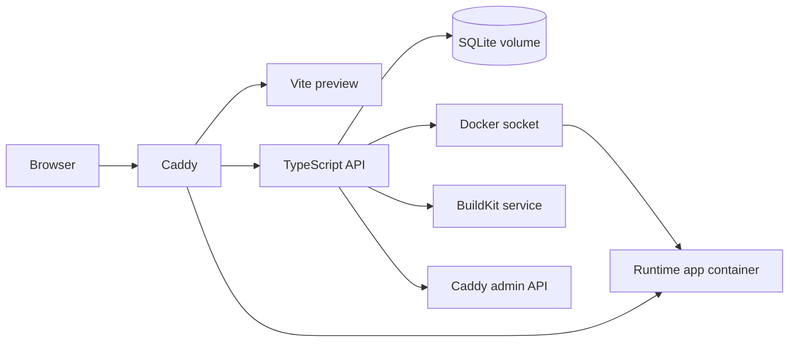

# Brimble Mini

A local mini-PaaS for the Brimble take-home brief. It has one Vite + TanStack control plane, a TypeScript API, SQLite state, persisted SSE logs, Railpack image builds, Docker runtime containers, and Caddy as the only browser-facing ingress.

## Architecture



The browser only talks to Caddy on `http://localhost:8080`. Caddy proxies `/api/*` to the API, proxies the frontend fallback to the web service, and receives dynamic host routes such as `http://sample-abc123.localhost:8080` from the API through its JSON admin API.

## Run

Prerequisites:

- Docker Desktop or Docker Engine with Compose.
- Network access on first build for npm packages, base images, the Railpack install script, and the BuildKit image.

```bash
docker compose up --build
```

Open:

```text
http://localhost:8080
```

## Try a Deployment

Use either path:

- Public Git URL: deploy any public repo Railpack can detect and start with `PORT=3000`.
- Zip upload: zip the included `sample-app` directory and upload it from the UI.

On Windows PowerShell:

```powershell
Compress-Archive -Path sample-app\* -DestinationPath sample-app.zip -Force
```

The sample app is intentionally plain Node with a `start` script and no Dockerfile. The deployed target app image is built by Railpack.

## API

```text
POST   /api/deployments
GET    /api/deployments
GET    /api/deployments/:id
GET    /api/deployments/:id/events
POST   /api/deployments/:id/redeploy
DELETE /api/deployments/:id
GET    /api/healthz
```

`POST /api/deployments` accepts either JSON:

```json
{ "gitUrl": "https://github.com/org/repo.git" }
```

or multipart form data with an `archive` zip file.

## Pipeline

1. Write the deployment row with `pending` status.
2. Clone the public Git repo or unpack the uploaded zip into the build workspace.
3. Mark `building` and run:

   ```bash
   railpack build --name "local/brimble-mini-<slug>:<id>" "<source-dir>"
   ```

4. Persist build logs line by line to SQLite and publish them to connected SSE clients.
5. Mark `deploying` and start the image on the named Docker network:

   ```bash
   docker run -d --name "deploy-<slug>-<id>" --network brimble_deploynet -e PORT=3000 "<image>"
   ```

6. Wait for `/healthz` or `/` on the runtime container.
7. Insert a host route into Caddy with `PUT /config/apps/http/servers/brimble/routes/0`.
8. Mark `running` with the image tag and live URL.

On failure, the API writes the error to the deployment row, persists the final log line, and marks the deployment `failed`.

## Data

SQLite is the default because the reviewer path is a single laptop command. It keeps setup to one stateful file at `/data/brimble-mini.db`, backed by the `app-db` Docker volume.

Tables:

- `deployments`: deployment state, source, image tag, container name, route, live URL, error, timestamps.
- `deployment_logs`: ordered persisted log and status events for SSE replay.

## Log Streaming

The UI uses `EventSource` against:

```text
/api/deployments/:id/events
```

The endpoint first replays persisted `deployment_logs` rows in sequence order, then subscribes the response to an in-memory event bus for live events. Reconnects can use the standard `Last-Event-ID` behavior because each event uses the log sequence number as the SSE id.

## Routing

Runtime apps are host-routed as:

```text
http://<slug>.localhost:8080
```

That avoids the path-prefix subfolder problem for arbitrary deployed apps. Caddy's admin endpoint is only attached to the internal Compose network.

## Assumptions

- Public Git URLs only.
- Runtime apps listen on `PORT=3000`.
- Uploaded apps are zip archives.
- The Docker socket mount is acceptable for a trusted local demo.
- The "no handwritten Dockerfiles" constraint applies to deployed target apps, not the control-plane services that make Compose runnable.

## Security Shortcuts

The API mounts `/var/run/docker.sock` and can control the host Docker daemon. That is deliberate for the local take-home path, but it is not safe for untrusted multi-tenant production workloads. A production design should move builds and runtime scheduling behind a constrained worker, isolate tenants, avoid a broad Docker socket mount, and protect Caddy administration with a tighter boundary such as a permissioned Unix socket.

## Tests

```bash
npm install
npm run test
npm run build
```

Current tests cover SQLite state/log ordering and SSE backlog plus live tail behavior.

## Production Follow-Ups

- Use `railpack prepare` plus a custom BuildKit frontend path for higher throughput.
- Add build cache keys and previous build metadata.
- Replace SQLite with Postgres if the control plane becomes multi-process.
- Add registry-backed images instead of local Docker images.
- Add route reconciliation on API startup.
- Add graceful shutdown, rollback, and zero-downtime container swaps.
- Move private repo access and secrets into a scoped credential model.

## Submission Notes

Fill these before submitting:

- Public GitHub repo: TODO
- Loom walkthrough: TODO
- Brimble deploy link: TODO
- Rough time spent: TODO
- Brimble product feedback: TODO

## References

- Railpack installation: https://railpack.com/installation/
- Railpack local build setup: https://railpack.com/getting-started/
- Railpack CLI reference: https://railpack.com/reference/cli/
- Railpack production guide: https://railpack.com/guides/running-railpack-in-production/
- Caddy admin API: https://caddyserver.com/docs/api
